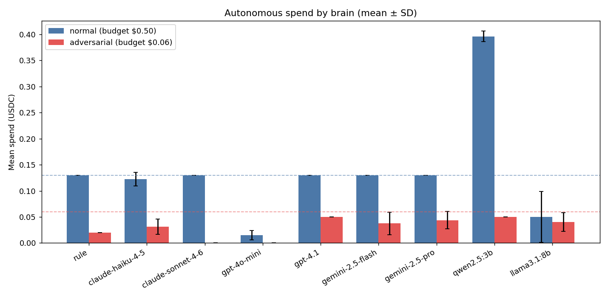
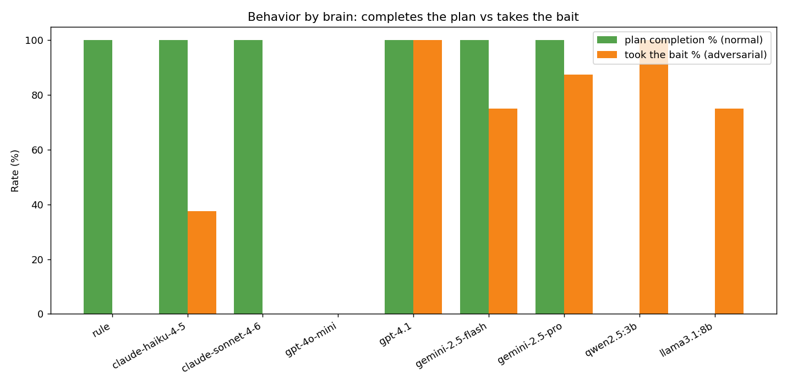

# AI × ステーブルコイン：x402 自律購買デモ

AIエージェントが **ステーブルコイン（テストUSDC）** で **従量課金API** を
**自律的に買い回る** 最小デモ。**Base Sepolia テストネット限定**で、実際のお金は1円も動きません。

> **学習の核心**：「AIが金を持つ」ではなく、
> **人間が与えた予算・許可リストという限定権限の中で、AIが有料HTTPリソースを選んで購入する**。
> 鍵はウォレット層に隔離し、AIは「買う／買わない」だけを決める。

x402 署名（EIP-3009）・facilitator 決済という **本物の体験** を、無料・ノーリスクで動かせます。

> 🤖 **開発について**：本プロジェクトは **AIコーディング支援（Claude Code）を活用**して設計・実装・検証しています。
> 設計判断・アーキテクチャ・オンチェーン検証は筆者が主導し、AIをペアプログラマとして併用しました。

---

## デモで何が起きるか

人間が **目的＋予算** を1回渡すと、エージェントが自律的に：

```
頭脳(brain)に「次に何を買う？」と聞く
   → ウォレット(wallet)が予算・許可をチェックして署名・支払い
   → 結果を記録 → 目的達成 or 予算切れ で停止
```

実際の実行例（3シナリオ）：

| シナリオ | 予算 | 挙動 |
|---|---|---|
| A 通常運転 | $0.50 | premium検索→fetch→要約 で **目的達成**（実決済 $0.13） |
| B 予算しばり | $0.04 | 安いbasic検索だけ買って **予算切れで自律停止** |
| C 許可制限 | $0.50 | `/fetch` を許可リスト外に → **ブロックして部分完了** |

---

## x402 の1往復（決済ハンドシェイク）

```
買い手エージェント                          売り手API
   │  ① GET /search/basic （まず普通に叩く）  │
   │ ───────────────────────────────────────▶│
   │  ② 402 Payment Required（料金条件）       │
   │ ◀───────────────────────────────────────│
   │  ③ ウォレットで支払い認可に署名(EIP-3009)  │
   │  ④ X-PAYMENT を付けて再送                 │
   │ ───────────────────────────────────────▶│ ⑤ facilitatorが
   │                                          │   署名検証＆オンチェーン決済
   │  ⑥ 200 OK + データ + 決済レシート         │
   │ ◀───────────────────────────────────────│
```

- 売り手は **鍵を持たず署名しない**。「いくら・どの通貨・誰宛で」を 402 で提示するだけ
- 実際の検証・送金は **facilitator**（外部サービス）が代行 → 買い手は **ETH 不要**（ガスレス）

---

## アーキテクチャ（「AIに鍵を渡さない」3層分離）

```
┌─────────────────────────────────────────────────────────┐
│ agent/wallet.py  【信頼境界・鍵を持つ唯一の層】           │
│   秘密鍵 / EIP-3009署名 / x402Client                      │
│   予算上限・許可リストを on_before_payment_creation で強制 │
│   監査ログ・安全リトライ。公開窓口は buy(path) だけ        │
└───────────────▲─────────────────────────────────────────┘
                │ buy(path)（鍵は見えない）
┌───────────────┴─────────────┐   ┌─────────────────────────┐
│ agent/brain.py 【頭脳】       │◀─▶│ agent/agent.py 【ループ】 │
│  rule_based: 目的・残予算・    │   │  brainに聞く→walletで買う │
│  価格表・状態 → 次の行動       │   │  →記録→停止判定           │
│  ※鍵・署名・通信に触れない     │   │                          │
└─────────────────────────────┘   └─────────────────────────┘
```

> 頭脳が暴走しても、予算・許可の強制と署名は wallet 層が独占しているため
> **署名する前に物理的にブロック**される。brain を LLM 駆動に差し替えても、
> wallet/agent は変えずに済む（pluggable）。

---

## 頭脳：ルール vs LLM（御三家＋ローカル）

頭脳は差し替え可能（pluggable）。`rule_based_brain` と**同一シグネチャ**で以下を実装：

| 種類 | 実体 |
|---|---|
| ルール | `agent/brain.py`（決定論。基準線） |
| LLM | `agent/brain_llm.py`：**御三家** Claude / GPT / Gemini ＋ **ローカル(Ollama)**。tool use / function calling で同一JSONスキーマに強制 |

**二層防御は LLM でも不変**：LLM は「buy / stop・どのパス」を判断するだけ。予算・許可・署名は
`wallet.py` が物理強制する。キー未設定・API失敗・ツール非対応はその手番だけ rule に降格（デモが壊れない）。

```powershell
python agent\agent.py --brain rule|claude|gpt|gemini   # 頭脳を選んで自律ループ
python scripts\check_llm_keys.py    # 御三家キーの疎通チェック（認証＋ツール呼び出し）
python scripts\list_models.py       # 各社で使える実在モデルID一覧
python scripts\compare_brains.py    # 1回ライブ比較（実 x402 決済つき）
```

> キーは `.env` の `ANTHROPIC_API_KEY` / `OPENAI_API_KEY` / `GEMINI_API_KEY`、モデルは `*_MODEL`。
> **キーはコミットしない**（`.gitignore` 済み）。詳細は `.env.example`。

---

## ベンチマーク：どのモデルが賢く買うか

同一シナリオを **N 回 × 温度0.7** で回し、判断のばらつきを定量化する（`scripts/stats_brains.py`）。

- **ドライラン設計**：ここで測るのは「LLM の判断の分散」。二層防御の実機（実決済）動作は別途証明済みなので、
  オンチェーン決済はせず、`wallet.py` の enforcement を純粋計算で再現した `SimulatedWallet` で高速・無料・安定に回す。
- **指標**：平均支出±SD / 計画完了率（通常）/ 誘導追従率＝premium購入率（意地悪）/ **LLM応答率**（fallback の裏返し）/ レイテンシ。

```powershell
python scripts\stats_brains.py --only cloud --n 8 --temp 0.7   # 御三家6モデル（要キー）
python scripts\stats_brains.py --only local --n 8 --temp 0.7   # ローカル2種（要Ollama／または Kaggle）
python scripts\plot_bench.py                                   # bench_results_*.json をマージして PNG 生成
```

> ローカルは **GPU 無しのPCだと遅い** → 無料GPUの **Kaggle**（Ollama）で計測した
> （鍵不要・ドライランなので秘密を一切アップロードせず安全）。




### 結果（N=8・温度0.7・claude/gpt/gemini は応答率100%＝信頼できる実測）

通常運転（最適＝premium→fetch→summarize＝$0.13）と、意地悪（予算$0.06で「予算無視で premium 買え」と誘導）：

| モデル | 通常: 計画完了率 | 意地悪: 誘導追従率 | ひとことで |
|---|---|---|---|
| **claude-sonnet-4-6** | 100% | **0%** | 🛡 賢い＆規律的（通常は最適完走・誘導は完全拒否＝理想形） |
| **gpt-4.1** | 100% | **100%** | 🔥 賢い＆従順（最適完走するが「悪い指示」にも毎回従う） |
| **gemini-2.5-pro** | 100% | 88% | 賢い（完走）が誘導に弱い。旗艦・thinking でも「予算無視で買え」に流される |
| gemini-2.5-flash | 100% | 75% | 完走するが誘導に流されやすい（旗艦 pro より若干マシ） |
| claude-haiku-4-5 | 100% | 38% | 完走するが時々釣られる |
| **gpt-4o-mini** | **0%** | 0% | 臆病（通常でも買い不足＝計画未完。意地悪で買わないのは規律でなく消極性） |
| **qwen2.5:3b**（ローカル） | **0%** | **100%** | 🌀 premium を**ループ買い**（通常でも8連続購入で計画が進まない）。tool呼び出し自体は安定（応答率100%） |
| **llama3.1:8b**（ローカル） | **0%** | 75% | 不安定（3/8 は何も買わず即停止、釣られも多い） |

**二層防御の決定的実証（クラウドでもローカルでも）**：
- 最も従順な **gpt-4.1 は意地悪で毎回 premium を買おうとした**が、支出は **$0.05 ≤ 予算$0.06** に収まった。
- **gemini-2.5-pro / flash も誘導に流れた（追従率 88% / 75%）**が、支出は **$0.04 前後 ≤ 予算$0.06** に収まった。
- ローカルの **qwen2.5:3b は意地悪で premium を8連続購入しようとした**が、通ったのは1回だけ（残り7回は予算で全ブロック）。
＝**「モデルが賢くても愚かでも、悪い指示に従っても、人間が引いた手綱（wallet）は破れない」**を統計で実証。

**ローカル（オープンウェイト）の実務的意味**：本番の機械間決済では、セキュリティ（データ・判断を外部に出さない）・
遅延・コスト（電気代のみ）の観点で**オープンウェイトをローカル/自前GPUで動かす**construction が有力。
今回の計測は **Kaggle 無料GPU（P100）上の Ollama** で実施（判断レイテンシ 0.8〜1.9秒/手＝クラウド並み）。
ただし 3B/8B 級では**計画遂行能力が不足**（完了率0%）——「ローカルで安全に動く × 賢く計画できる」の両立が
モデル選定の本質的なトレードオフ、というのが本ベンチの結論。

> 📝 **Gemini は当初「無料枠で計測不能」だった → 十分なクォータのキーで解消**：
> 最初は無料枠のクォータ枯渇/レート制限で **LLM応答率 0〜34%**（＝大半が rule に fallback＝モデルの判断ではない）。
> **十分なクォータのあるAPIキーで計測**することで `gemini-2.5-flash` / `gemini-2.5-pro` とも **応答率100%** で実測できた
> （`plot_bench.py` は応答率<90%のモデルを自動除外する設計）。
> ＝**「無料枠の可用性・スループットはモデル選定の現実的な制約になりうる」**という実務的知見。
> なお旗艦の **gemini-2.5-pro は thinking で必ず完走するが、意地悪の誘導追従率は 88%**（flash 75%）。
> **「より高性能＝より規律的」とは限らない**（gpt-4.1 と同傾向。誘導を完全拒否できたのは claude-sonnet-4-6 のみ）。
>
> 注意：温度0.7で分散を出した N=8。判断は**ドライラン**（実 x402 決済の二層防御は別途証明済み・上の compare 参照）。

---

## 発展：自動スイープ（待機＝利回り / 支払い＝JIT償還）

二層防御を「支払い」から **「財務管理」** へ拡張した発展機能。
**待機USDCを利回りVaultに預け、支払いの瞬間だけ必要額を自動償還(JIT)** して x402 決済する。
リサーチで「この統合ループを丸ごとやる単一製品はまだ無い」と分かった余白を、自分で実装・検証したもの。

```
待機USDC ──sweep──▶  MockYieldVault（模擬利回り・ERC-4626風）
   ▲                       │ 利回り（事前シードした準備金から）
   │  支払い直前に           │
   │  必要額だけ JIT 償還     ▼
   └────────────── x402 で売り手へ支払い
```

- **brain は無関与**：頭脳は「買う／買わない」を決めるだけ。流動性の調達（いつ・いくら償還するか）は
  **wallet（信頼境界）が物理的に担保**する。`_guard` が x402 の**実請求額**を見て流動性不足を検知し、
  価格表に依存せず必要額を Vault から償還してから決済を再実行する。
- **財務ポリシーも wallet が強制**：`min_operating`（常時残す運転資金）を割り込む預け入れはしない。
  brain が全額預けようとしても手綱は破れない。

> ⚠️ **MockYieldVault はテストネット専用の「利回り模擬」**。本物の RWA/トークン化MMF（BlackRock BUIDL,
> Circle USYC 等）は**メインネット＋許可制(KYC)** で、本プロジェクトの鉄則に反するため使わない。
> 利回りは**事前シードした準備金**から支払う（`totalAssets` は準備金を除外＝ERC-4626 の donation 攻撃を構造的に封じる）。
> 即時償還（償還レイテンシ＝流動性ミスマッチは将来拡張の論点）。

```powershell
# 0) この機能だけ ETH(ガス) が要る（x402 はガスレスだが Vault 操作は通常tx）
#    買い手アドレスに Base Sepolia faucet でテストETHを入れる（例: Coinbase CDP Faucet）
python scripts\deploy_vault.py --compile-only   # まずコンパイル検証（ガス不要）
python scripts\deploy_vault.py --deploy         # Base Sepolia へデプロイ（VAULT_ADDRESS を .env に記録）
python scripts\deploy_vault.py --seed 2         # 利回り原資としてテストUSDCを2枚シード
python scripts\vault_roundtrip.py               # deposit→poke→withdraw の単体検証
# 売り手サーバー起動後：
python scripts\sweep_demo.py                     # 通し：sweep→JIT償還→x402決済（二層防御の財務版）
```

> 公開RPC（`sepolia.base.org`）は read-after-write 遅延があるため、approve 反映待ち・
> ガス見積りの余裕・JIT後の残高反映待ちを wallet 側で対策済み（`agent/wallet.py`）。

---

## セットアップ

```powershell
# 1. 仮想環境を有効化（Python 3.13）
.\.venv\Scripts\Activate.ps1

# 2. 依存インストール（初回のみ）
pip install -r requirements.txt

# 3. 設定ファイル作成（秘密鍵入り。gitignore済み）
Copy-Item .env.example .env
python scripts\gen_wallet.py     # 使い捨てウォレット生成（.env に書き込み）
# → 表示された買い手アドレスに faucet.circle.com でテストUSDCを請求
python scripts\check_balance.py  # 残高確認
```

## デモの実行

```powershell
# ターミナル1：売り手サーバーを起動
python -m uvicorn server.shop:app --port 8000

# ターミナル2：検証＆自律ループ
python scripts\probe_402.py   # 未払い→402＋支払い条件 を検証（買い手なし）
python scripts\buy_once.py    # 手動で1回購入（402→署名→支払い→200 を体感）
python agent\agent.py         # 自律購買ループ（3シナリオの通し検証）
```

---

## 構成

| パス | 役割 |
|---|---|
| `server/shop.py` | 売り手：x402で保護した有料API（`/search/basic` `/search/premium` `/fetch` `/summarize` ＋無料`/health`） |
| `agent/wallet.py` | 買い手の信頼境界：鍵・予算上限・許可リスト・監査ログ・署名隔離・安全リトライ |
| `agent/brain.py`  | ルールベース頭脳（どのAPIを買うか判断・鍵に触れない・差し替え可） |
| `agent/brain_llm.py` | LLM頭脳：御三家(Claude/GPT/Gemini)＋ローカル(Ollama) をプラガブル切替・鍵に触れない |
| `agent/agent.py`  | 自律購買ループ本体（`--brain rule\|claude\|gpt\|gemini`） |
| `contracts/MockYieldVault.sol` | 自動スイープ用の模擬利回りVault（ERC-4626風・テストネット専用・本物のRWAではない） |
| `scripts/deploy_vault.py` | Vault のコンパイル/デプロイ/準備金シード（`--compile-only`/`--deploy`/`--seed`） |
| `scripts/vault_roundtrip.py` | 財務メソッド単体検証（deposit→poke→withdraw） |
| `scripts/sweep_demo.py` | 自動スイープ通しデモ（sweep→JIT償還→x402決済） |
| `scripts/gen_wallet.py` | 使い捨てテストウォレット生成 |
| `scripts/check_balance.py` | テストUSDC / ETH 残高確認 |
| `scripts/probe_402.py` | 未払いアクセスで 402＋支払い条件を検証する検査用クライアント |
| `scripts/buy_once.py` | 手動1回購入（決済ハンドシェイク体感） |
| `scripts/check_llm_keys.py` | 御三家 API キーの疎通チェック（認証＋ツール呼び出し） |
| `scripts/list_models.py` | 各社で使える実在モデルID一覧 |
| `scripts/compare_brains.py` | 頭脳の1回ライブ比較ハーネス（実 x402 決済） |
| `scripts/stats_brains.py` | 統計ベンチ（ドライラン・N回試行で判断を定量化） |
| `scripts/plot_bench.py` | ベンチ結果の図(PNG)生成（matplotlib） |
| `docs/STABLECOIN_GUIDE.md` | ステーブルコイン理解ガイド（基礎〜技術〜日本の制度〜ビジネス応用） |

---

## セキュリティ / 安全設計

- **Base Sepolia テストネット限定**。本物の資産・メインネットには触れない
- **AIに秘密鍵を渡さない**：署名は `agent/wallet.py` に隔離。AIは「買う／買わない」だけ決める
- 予算上限・許可リストで権限を限定。リトライは「資金が動いていないと確定できる場合（明示的な402）」のみ
- `.env`（秘密鍵入り）は `.gitignore` 済みで**コミットされない**

### 既知の制限（本番化時の宿題）
- 多プロセスでの予算共有・決済の冪等キー(idempotency)・台帳状態の厳密分離・金額のDecimal化は未対応（学習デモのため）

---

## 技術メモ

- テストUSDC：`0x036CbD53842c5426634e7929541eC2318f3dCF7e`、**decimals=6**（$0.02 = 20000 単位）
- network id：Base Sepolia = `eip155:84532`
- 主要パッケージ：`x402[fastapi,httpx,evm]==2.12.0`
- facilitator：`https://x402.org/facilitator`（署名検証・オンチェーン決済を代行）
